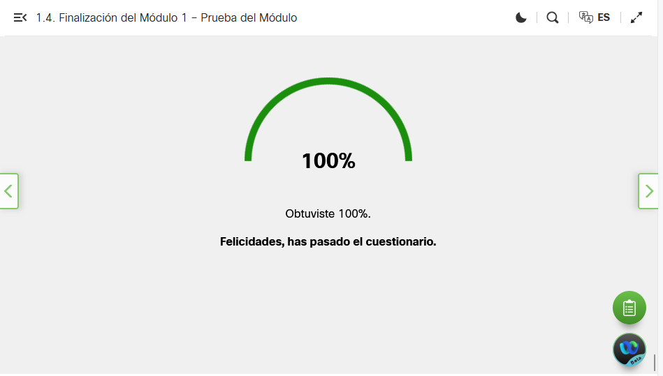
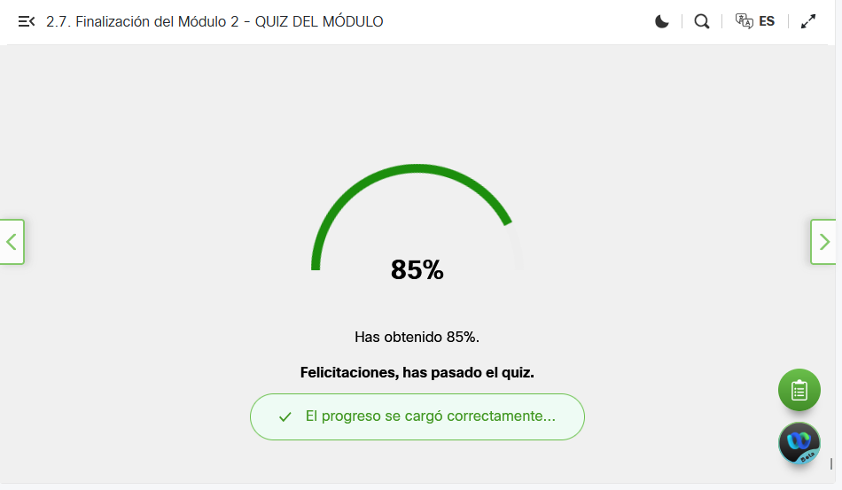
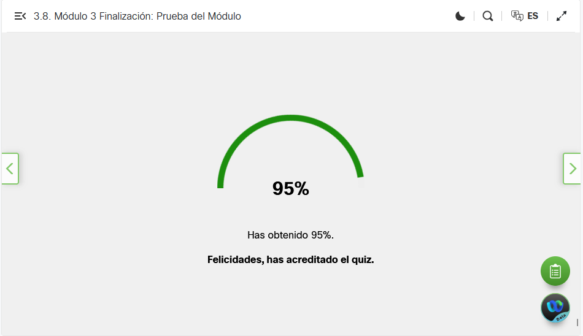
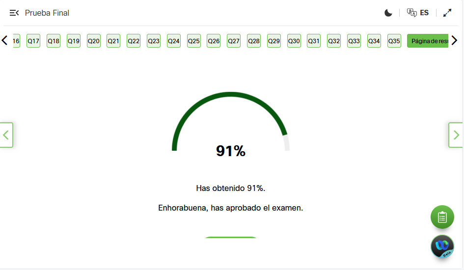

# IoT_EvaluacionUnidad_II_IsaacCanoHernandez

|Codigo  |Video|Descripción|
|--|--|--|
|Ejercicio|<video><source src="" type="video/mp4"></video>|Hola|

## Ejercicio Integral

## Ejercicios en Clases
|Ejercicio|Video|Descripción|
|--|--|--|
|BotonLed_Arduino|https://drive.google.com/file/d/1esXZOkuSg6dhZxRPw_NAsXT-bKNmiBhP/view?usp=drive_link|En este ejercicio se buscaba prender un led al dar clic a un boton con una esp3, en Arduino con C|
|BotonLed_Python|https://drive.google.com/file/d/1W4DLEzPFOttdl3wV0Ty4XCekcn0I2Pmc/view?usp=drive_link|En este ejercicio se buscaba prender un led al dar clic a un boton con una esp3, en Thonny con Python|
|Buzzer_Python|https://drive.google.com/file/d/1IUh0UKatk0cTCoHMiILEc9ZKn7_sxcBI/view?usp=drive_link|En este ejercicio se buscaba activar un buzzer dandole una tonada con una esp3, en Thonny con Python|
|JoystickRgb_Arduino|https://drive.google.com/file/d/15nIewDEJMaxbJfVhzLw8dfk3uZnT34g2/view?usp=drive_link|En este ejercicio se buscaba encender un led rgb con los movimeintos de un joystick con una esp3, en Arduino con C|
|JoystickRgb_Python|https://drive.google.com/file/d/13n45MUElupELxHqEOChcGjkQla8ArjXa/view?usp=drive_link|En este ejercicio se buscaba encender un led rgb con los movimeintos de un joystick con una esp3, en Thonny con Python|
|MatrizLed_Python|https://drive.google.com/file/d/1Q_yl19ITOVoXl8j9bbNLm36k5o44UfjG/view?usp=drive_link|En este ejercicio se buscaba encender una matriz de lesd mostrando un mensaje con una esp3, en Thonny con Python|
|MatrizLedsSensor_Python|https://drive.google.com/file/d/1-pqF15vcXiVIBHd0okTFpO5soZ1zXKkj/view?usp=drive_link|En este ejercicio se buscaba encender una matriz de lesd mostrando la distancia de un objeto que toma un ultrasonic sensor con una esp3, en Thonny con Python|
|Motor_Python|https://drive.google.com/file/d/1XD9D959qapjtrndSvD4tg8uoITUZJa7_/view?usp=drive_link|En este ejercicio se buscaba encender y hacer girar un motor con una esp3, en Thonny con Python|
|Motor_Aurduino|https://drive.google.com/file/d/1zVPQLQ_Okk74SUrV7n35RspFEqqz8tK9/view?usp=drive_link|En este ejercicio se buscaba encender y hacer girar un motor con una esp3, en Arduino con C|
|OledPotencimetro_Arduino|https://drive.google.com/file/d/1JreLoXyJkRMRUPkNHAzAP9zZGMK2uyRE/view?usp=drive_link|En este ejercicio se buscaba enceder y mostrar en el oled el porcentaje que marca el potencimetro con una esp3, en Arduino con C|
|OledPotencimetro_Python|https://drive.google.com/file/d/12Kns2KpP7y6YAdoMnM_EFRsQDgevNspM/view?usp=drive_link|En este ejercicio se buscaba enceder y mostrar en el oled el porcentaje que marca el potencimetro con una esp3, en Thonny con Python|
|SensorLeds_Arduino|https://drive.google.com/file/d/1J-CdXtZTICzwYKyCdPfUOQs9BjWlw5JM/view?usp=drive_link|En este ejercicio se buscaba enceder 3 led dependiendo el acercamiento al sensor con una esp3, en Arduino con C|
|SensorLeds_Python|https://drive.google.com/file/d/15cFuRU514qZ9lqh1Te6e0j-uaAoRs6C9/view?usp=drive_link|En este ejercicio se buscaba enceder 3 led dependiendo el acercamiento al sensor con una esp3, en Thonny con Python|

## Avance Muñeco Navideño

## Curso Python NetaCad
|Modulo|Prueba|
|--|--|
|Modulo 1||
|Modulo 2||
|Modulo 3||
|Modulo 4||
|Modulo Final||

Los conocimientos adquiridos en mi curso de Python en NetaCad me permitirán configurar componentes para un muñeco usando MicroPython. Podre declarar variables para configurar entradas o pines conectados a distintos componentes que controlen el movimiento del muñeco. Ademas, programar los metodos 'instrucciones' y agregarlos a un ciclo infinito el cual me ayudara a que los componente se ejedcuten continuamente sin parar.

## Coevaluacion
Nombre del compañero evaluado: Jesús Eduardo Olvera Hernández.

La forma en la que se desempeño mi compañero en las actividades realizadas en clases fuen buena, ya que distinge con facilidad todos los pines de la ESP32, al momento de utilizar componente o herremientas como Servomotores, leds, sensores, distinge en que pines se tienen que conectar correctemente, tiene una facilidad para conectarlos de una menra rapida con la ESP32, cuenta con el conocimiento sobre como es que funciona una Protoboard, pero necesitaria despeñarse un poco mas en la parte de programar las instrucciones para poder hechar a andar los componente, claro, conoce la estructura del codigo, pero necesita desempeñarse un poco mas, creo que todo lo demas tiene un buen conocimiento, solo seria mejorar la parte de programar.

